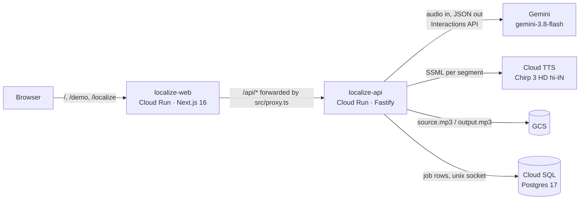

# Intent-Preserving Localization

**AI Builder Cup 2026 (JAPAC) · Theme: Media, Content & Digital Experiences**

Localizes educational English audio into Hindi while preserving the _pedagogical
signal_: the term the teacher stressed, the slow-down before a definition, the
tonal shift before a warning, the idiom that made an abstraction stick. Literal
dubbing keeps the words and loses the teaching. This pipeline keeps the teaching.
Every non-literal choice carries its own rationale, and a blind back-translation
critique scores each segment for instructional fidelity _and_ naturalness, so an
educator can audit the machine's judgment instead of trusting it.

- **Live:** https://localize-web-13108575259.asia-south1.run.app
- **Demo, no sign-in:** https://localize-web-13108575259.asia-south1.run.app/demo
- **Spec:** [`docs/SPEC.md`](docs/SPEC.md): problem, schemas, signal taxonomy, phases
- **Verified Google docs, quotas and measurements:** [`docs/research.md`](docs/research.md)
- **Self-grilling per phase:** [`docs/JUDGE_NOTES.md`](docs/JUDGE_NOTES.md)

## Architecture



The browser only ever talks to the web origin. `web/src/proxy.ts` forwards
`/api/*` to the API at runtime, so the session cookie is first-party and the web
image carries no build-time knowledge of where the API lives. A job runs
in-process on the API after the upload returns 202, and the UI polls it. That is
why the API runs with `--no-cpu-throttling`, `min-instances=1` and
`max-instances=1` (see [`docs/research.md` § Cloud Run](docs/research.md#cloud-run)).

## The pipeline

One job, five typed stages, in `src/modules/localize/`. Every Gemini call returns
JSON validated by a Zod schema. That one schema is also the model's
`response_format`, the database row's shape and the API's serializer.

| Stage          | What it does                                                                                                                                                                                                                                                                                                                                         | Model                |
| -------------- | ---------------------------------------------------------------------------------------------------------------------------------------------------------------------------------------------------------------------------------------------------------------------------------------------------------------------------------------------------- | -------------------- |
| 0 · Ingest     | ffmpeg normalizes the upload to 16 kHz mono mp3 (≤ 25 MB, ≤ 180 s), stored in GCS                                                                                                                                                                                                                                                                    | none                 |
| 1 · Analyze    | Segments at _pedagogical_ boundaries from the audio itself. Labels each segment with one of 7 signals (definition, key term, example, warning, emphasis shift, transition, recap) plus register, pace, emphasis and idioms. Measured ffmpeg pause and energy data goes in beside the audio, and each emphasis claim is later corroborated against it | Gemini, native audio |
| 2 · Adapt      | A brief and glossary over the whole clip, then segment-by-segment Hindi (Devanagari) that re-teaches rather than transcodes. Each segment carries a literal translation, a rationale, one `why` per non-literal choice, and TTS hints                                                                                                                | Gemini               |
| 3 · Critique   | A separate call, blind to the rationale, back-translates and scores fidelity and naturalness. Failing segments are re-adapted **once** with the critique attached                                                                                                                                                                                    | Gemini               |
| 4 · Synthesize | Chirp 3 HD per segment, with the speaking rate and pauses stage 1 asked for, joined losslessly. Only the prosody controls the spike measured as actually honoured are used                                                                                                                                                                           | Cloud TTS            |

The UI shows the English and Hindi side by side, with a reasoning panel per
segment: signal and evidence, emphasis claims against measured energy, literal
vs adapted text, the rationale, the blind critic's scores and back-translation,
the exact SSML sent, and the tokens and latency it all cost. The panel makes
no model calls of its own. Everything on it was produced by the pipeline and
stored on the job.

## Running it locally

Requires Node ≥ 22.18, Docker, ffmpeg, and a Gemini API key from AI Studio.
`deploy/gcp/setup.sh` walks through the Google Cloud side (project, billing,
TTS, bucket, key, ADC).

```bash
npm ci && (cd web && npm ci)
docker compose up -d postgres          # PG_PUBLISHED_PORT=5433 if 5432 is taken
npm run migrate
npm run dev                            # API on :3000
(cd web && npm run dev)                # UI on :3001, /api/* forwarded to :3000
```

Each stage also runs alone against a clip, with no server and no database:

```bash
npm run stage:analyze -- fixtures/sample_60s.mp3   # → outputs/analysis.json
npm run stage:adapt                                # → outputs/adaptation.json
npm run stage:critique                             # → outputs/critique.json
npm run stage:synthesize                           # → outputs/output.mp3
npm run pipeline -- fixtures/sample_60s.mp3        # all of the above
```

Tests: `npm run test:unit` (no database) and `npm run test:integration`
(Postgres up; the pipeline is stubbed through the `Stages` seam in
`localize.service.ts`). The whole product over HTTP, on real models:

```bash
ADMIN_PASSWORD=... npm run create-admin -- e2e@local.test --create
npm run e2e:localize -- --password=... fixtures/sample_60s.mp3
```

## Deploying to Google Cloud

```bash
bash deploy/gcp/deploy.sh
```

This is idempotent. It enables the APIs and creates the Artifact Registry repo,
the bucket, a least-privilege runtime service account, the Secret Manager
secrets, Cloud SQL, both images (Cloud Build), a `localize-ops` Cloud Run job
that runs migrations before the API rolls, both services, and the shared demo
account. Then:

```bash
# The fixture through the deployed web origin, on real models
node src/scripts/e2e-localize.ts --base=$WEB --origin=$WEB --email=demo@example.com \
  --password="$(gcloud secrets versions access latest --secret=DEMO_PASSWORD)"
# Make that job the public /demo
gcloud run jobs execute localize-ops --region=asia-south1 --wait \
  --args=dist/scripts/promote-demo.js,<jobId>
# What a signed-out judge gets
node src/scripts/check-demo.ts --base=$WEB
```

## Measured in production

The fixture (a 63 s English explainer) through the deployed web origin, on real
models, 2026-09-11. `node src/scripts/e2e-localize.ts` against the live URL:

| Item                                             | Value                                                                                                 |
| ------------------------------------------------ | ----------------------------------------------------------------------------------------------------- |
| Upload → done                                    | **229.9 s** (analyze 83.0 s · brief + adapt 128.8 s · critique 6.5 s · synthesize 6.3 s)              |
| Segments                                         | 7 (transition, example ×3, recap, definition, transition)                                             |
| Model calls                                      | 10 Gemini calls, 29,095 in / 7,443 out / 43,407 thinking tokens                                       |
| Blind critique                                   | fidelity 95, naturalness 91, no segment needed a retry                                                |
| Emphasis claims backed by a measured energy rise | 9 of 15, and the other 6 are shown as unsupported                                                     |
| Hindi audio                                      | 70.1 s for a 63.0 s source span, 1,336 billed TTS characters                                          |
| Signed-out checks (`check-demo.ts`)              | `/demo` 200 · demo Job parses · Range 206 on both audio files · 26 MiB upload → 413 through the proxy |

That wall clock is inside the 216–238 s localhost range, so the Cloud Run
deployment itself adds nothing measurable. It is still about twice SPEC's
120 s budget, and roughly 93% of it is the model thinking in analyze and adapt.

## Honest limits

- The critic is the same model family as the adapter. Blinding it to the
  rationale stops it from laundering a bad choice by reading the justification,
  but it is not an independent review. Scores are shown including the failures.
- Chirp 3 HD ignores SSML `<emphasis>` and `<prosody rate>` (measured). Emphasis
  is realized as a pause before one term per segment, and the UI marks every
  stressed term the voice did not realize.
- A 60 s clip takes several minutes end to end, because nearly all of the time
  is analyze and adapt thinking. The public `/demo` is a real job this API ran,
  promoted afterwards, so a first look costs no wait.
- No native Hindi reviewer has signed off on the output yet.

## Provenance

Built for the AI Builder Cup 2026. The Fastify + TypeScript + Postgres API
skeleton and the Next.js auth UI in `web/` are a starting template cloned on
7 Sept 2026. Its reference documentation is kept verbatim in
[`docs/BOILERPLATE.md`](docs/BOILERPLATE.md). All localization code, prompts,
schemas, scripts and docs were written from 7 Sept 2026 on (`git log`). Generative
work uses Google models only: Gemini `gemini-3.8-flash` and Cloud Text-to-Speech
Chirp 3 HD.
